# Hermes Skills

> 🛒🎬 **Hermes Agent 电商直播专用技能集合** — 竞品分析、视频剪辑、话术审核等核心工作流开箱即用

[](https://github.com/yehyakin/hermes-skills/stargazers)
[](https://github.com/yehyakin/hermes-skills/blob/main/LICENSE)
[](https://www.python.org/)
[](https://github.com/nousresearch/hermes-agent)
[](https://github.com/yehyakin/hermes-skills/commits/main)

[English](README_en.md) | 中文

---

## 📖 项目介绍

Hermes Skills 是专为**直播电商场景**打造的 Hermes Agent 技能集合，涵盖男装/女装直播带货的全链路需求：

- 🔍 **竞品监控** — 抖音视频获取、账号分析、话术采集
- ✂️ **视频剪辑** — Whisper 转写、FFmpeg 精剪、剪映草稿生成
- ✅ **话术审核** — 直播话术质量评审、任务交付打分
- 🖥️ **系统诊断** — Hermes/OpenClaw 健康监控、错误归因

所有 Skills 均可独立使用，也可通过 `hermes-router` 自动路由。

---

## 🏗️ 架构图

```mermaid
graph TB
    subgraph "用户交互层"
        U[👤 用户请求]
    end

    subgraph "Hermes Agent"
        R[🔀 hermes-router<br/>Intent Router]
        A[🤖 Hermes Agent Core]
    end

    subgraph "Skills 技能层"
        subgraph "🛒 电商运营"
            NF[📝 neirong-fuoli<br/>内容资产复利化]
            DY[📥 douyin-video-acquisition<br/>抖音视频获取]
            HR[🔬 ecommerce-short-video-hook-research<br/>短视频钩子研究]
            VD[🗺️ ecommerce-video-discovery<br/>高光发现路由]
            VP[🚀 ecommerce-video-publishing<br/>自动发布流水线]
        end

        subgraph "🎬 视频剪辑"
            JE[✂️ jianying-editor<br/>剪映桌面版]
            JES[📋 jianying-editor-skill<br/>CapCut 草稿生成]
            WV[🎙️ whisper-video-clipping-workflow<br/>Whisper 转写精剪]
            EV[🎞️ ecommerce-video-clip-workflow<br/>竞品视频精剪]
            EH[✨ ecommerce-video-highlights<br/>高光片段提取]
            EC[👁️ ecommerce-visual-clip-scanning<br/>视觉带货识别]
            ES[🎬 ecommerce-video-clip-to-shortform<br/>直播→短切片]
            YY[🕊️ yoyo-video-clipping-workflow<br/>悠悠有鸽竞品精剪]
        end

        subgraph "⚖️ 监查审计"
            SQ[🎯 speech-quality-review<br/>话术质量审议]
            TD[📊 task-delivery-scoring<br/>任务交付审计]
            SH[💚 system-health-monitor<br/>系统健康审计]
            EA[🔍 error-attribution-analysis<br/>错误归因审计]
        end
    end

    subgraph "MCP 工具层"
        MV[mcp__video__*<br/>视频处理工具]
        MF[mcp__feishu__*<br/>飞书集成工具]
    end

    U --> R
    R --> A
    A --> NF & DY & HR & JE & JES & WV & EV & EH & EC & ES & YY & SQ & TD & SH & EA & VD & VP
    JE & WV & EV --> MV
    SQ & TD --> MF

    style U fill:#e1f5fe
    style R fill:#fff3e0
    style A fill:#f3e5f5
```



---

## 📂 目录结构

```
hermes-skills/
├── .github/
│   └── ISSUE_TEMPLATE/
│       ├── bug_report.md
│       ├── feature_request.md
│       └── config.yml
├── douyin-video-acquisition/        # 抖音视频获取
├── ecommerce-short-video-hook-research/  # 短视频钩子研究
├── ecommerce-video-clip-to-shortform/   # 直播→短切片流水线
├── ecommerce-video-clip-workflow/   # 竞品视频精剪
├── ecommerce-video-discovery/        # 高光发现路由器（新增）
├── ecommerce-video-highlights/      # 高光片段提取
├── ecommerce-visual-clip-scanning/  # 视觉带货识别
├── ecommerce-video-publishing/       # 自动发布流水线（新增）
├── error-attribution-analysis/      # 错误归因审计
├── hermes-router/                   # Intent Router
├── jianying-editor/                 # 剪映桌面版
├── jianying-editor-skill/           # CapCut 草稿生成
├── neirong-fuoli/                   # 内容资产复利化
├── speech-quality-review/            # 话术质量审议
├── system-health-monitor/            # 系统健康审计
├── task-delivery-scoring/            # 任务交付审计
├── whisper-video-clipping-workflow/  # Whisper 转写精剪
└── yoyo-video-clipping-workflow/     # 悠悠有鸽竞品精剪
```

---

## 🚀 快速开始

### 1. 安装 Hermes Agent

```bash
# 克隆 Hermes Agent
git clone https://github.com/nousresearch/hermes-agent.git
cd hermes-agent

# 安装依赖
pip install -r requirements.txt
```

### 2. 克隆 Skills 仓库

```bash
# 克隆本仓库
git clone https://github.com/yehyakin/hermes-skills.git

# 链接到 Hermes skills 目录
ln -s /path/to/hermes-skills ~/.hermes/skills
```

### 3. 使用示例

```python
# 在 Hermes Agent 中使用
用户: "帮我分析一下这个抖音竞品视频"
Agent: (自动路由到 douyin-video-acquisition)
```

---

## 📊 Skills 分类表格

### 🛒 电商运营 (Ecommerce)

| Skill | 说明 | 触发词 | 状态 |
|-------|------|--------|------|
| 📝 `neirong-fuoli` | 内容资产复利化 - 男装直播话术、产品卖点、爆款案例管理 | /记录选题、/深化选题、/生成话术、/适配多平台、/找素材、/记录数据、/月度复盘、/优化话术、/存档钩子 | ✅ 稳定 |
| 📥 `douyin-video-acquisition` | 抖音视频获取与解析 - 从分享链接下载视频 | 抖音视频、竞品视频、v.douyin.com | ✅ 稳定 |
| 🔬 `ecommerce-short-video-hook-research` | 短视频带货钩子研究 - 爆款钩子分析 | 带货钩子、爆款分析、短视频钩子 | ✅ 稳定 |
| 🗺️ `ecommerce-video-discovery` | 高光发现路由器 - 自动选择 Whisper/视觉/AutoClip 路径 | 发现高光、找带货片段、分析视频片段、竞品视频发现 | ✅ 稳定 |
| 🚀 `ecommerce-video-publishing` | 自动发布流水线 - 生成发布清单 + 飞书通知 + 数据回流 | /发布视频、/发布到抖音、/推送发布报告、/完整发布 | ✅ 稳定 |
| 🕵️ `error-attribution-analysis` | 错误归因审计 - 根因分析+责任归属 | 错误分析、问题诊断、出错了 | ✅ 稳定 |

### 🎬 视频剪辑 (Media)

| Skill | 说明 | 触发词 | 状态 |
|-------|------|--------|------|
| ✂️ `jianying-editor` | 剪映桌面版自动剪辑 - 素材导入、字幕、配音、导出 | 剪映自动剪辑、视频精剪 | ⚠️ 草稿 |
| 📋 `jianying-editor-skill` | CapCut 草稿生成 - Mac 剪映草稿 SDK | CapCut、草稿生成 | ✅ 稳定 |
| 🎙️ `whisper-video-clipping-workflow` | Whisper 转写精剪 - 长视频转写+AI识别高光切片 | 视频转写、字幕切片、Whisper | ✅ 稳定 |
| 🎞️ `ecommerce-video-clip-workflow` | 竞品视频精剪 - AI转写+识别带货节点+精剪 | 竞品视频、竞品分析、视频精剪 | ✅ 稳定 |
| ✨ `ecommerce-video-highlights` | 电商高光片段提取 - ffmpeg+Whisper+视觉AI | 高光片段、精彩瞬间、挂车片段 | ✅ 稳定 |
| 👁️ `ecommerce-visual-clip-scanning` | 视觉带货识别 - 画面抽帧+AI分析 | 视觉识别、画面分析、无字幕视频 | ✅ 稳定 |
| 🎬 `ecommerce-video-clip-to-shortform` | 直播→短切片流水线 - Whisper+SRT+FFmpeg | 直播切片、带货切片、短视频制作 | ✅ 稳定 |
| 🕊️ `yoyo-video-clipping-workflow` | 悠悠有鸽竞品精剪 - 完整流水线示例 | 竞品精剪、悠悠有鸽、YoYo视频 | ✅ 稳定 |

### ⚖️ 监查审计 (Audit)

| Skill | 说明 | 触发词 | 状态 |
|-------|------|--------|------|
| 🎯 `speech-quality-review` | 话术质量审议 - 直播话术评分≥7.0 | 话术审核、话术评审、直播话术 | ✅ 稳定 |
| 📊 `task-delivery-scoring` | 任务交付审计 - 准确性/完整性/时效性评分 | 任务评分、交付审计、AI任务打分 | ✅ 稳定 |
| 💚 `system-health-monitor` | 系统健康审计 - Hermes/OpenClaw 进程/日志/资源 | 系统监控、健康检查、进程状态 | ✅ 稳定 |

### 🔀 系统路由 (System)

| Skill | 说明 | 触发词 | 状态 |
|-------|------|--------|------|
| 🔀 `hermes-router` | Intent Router - 用户意图自动路由到正确 Skill | 路由、应该用哪个Skill、skill dispatch | ✅ 稳定 |

---

## 💼 应用案例

### 案例 1：竞品视频分析全链路

```
用户: "分析一下秦磊男装的直播话术"
  ↓
hermes-router → ecommerce-video-discovery (自动路由)
  ↓
douyin-video-acquisition (获取视频)
  ↓
whisper-video-clipping-workflow (转写字幕)
  ↓
ecommerce-video-highlights (AI 识别带货片段)
  ↓
jianying-editor-skill (剪映精剪)
  ↓
ecommerce-video-publishing (发布清单 + 飞书通知)
  ↓
用户: "已发布" → 推送发布报告
  ↓
数据自动回流 neirong-fuoli 素材库
  ↓
输出: 竞品分析报告 + 优质话术库 + 发布记录
```

### 案例 2：直播切片自动化

```
用户: "把这个3小时直播切成10个带货短视频"
  ↓
hermes-router → ecommerce-video-discovery
  ↓
自动执行: Whisper转写 → SRT挖掘爆点 → FFmpeg精切 → PIL字幕包装
  ↓
ecommerce-video-publishing (生成发布清单)
  ↓
用户: "已在剪映发布" → 推送发布报告
  ↓
数据自动回流 neirong-fuoli
  ↓
输出: 10个带字幕的带货短视频 + 发布记录
```

### 案例 3：钩子研究 → 话术复用

```
用户: "研究一下最近爆款男装的钩子"
  ↓
ecommerce-short-video-hook-research (获取爆款钩子)
  ↓
neirong-fuoli 指令10: /存档钩子 (打标签存入金句库)
  ↓
用户: "基于这些钩子写一个新品话术"
  ↓
neirong-fuoli /生成话术 (从金句库复用)
  ↓
输出: 新品话术 + 素材复用记录
```

---

## 🛠️ 技术栈

| 类别 | 技术 |
|------|------|
| **AI 模型** | OpenAI Whisper, Claude Vision, GPT-4o |
| **视频处理** | FFmpeg, 剪映 CapCut, yt-dlp |
| **框架** | Hermes Agent, MCP (Model Context Protocol) |
| **脚本语言** | Python 3.9+ |
| **数据存储** | JSON, Markdown, SQLite |
| **集成** | 飞书, Chrome DevTools Protocol (CDP) |

---

## 📦 Skill 格式规范

每个 Skill 包含：

```
skill-name/
├── SKILL.md          # Skill 定义（名称、描述、触发词、执行步骤）
├── examples/          # 使用示例
│   └── example_1.py
├── scripts/           # 自动化脚本（可选）
└── references/        # 参考文档（可选）
```

### SKILL.md Frontmatter 格式

```yaml
---
name: skill-name
description: 简短描述
category: ecommerce|media|audit|system
version: "1.0.0"
triggers:
  - 触发词1
  - 触发词2
---
```

---

## 🤝 贡献

欢迎提交 Issue 和 Pull Request！

- 🐛 发现 Bug？请提交 [Bug Report](https://github.com/yehyakin/hermes-skills/issues/new?template=bug_report.md)
- 💡 有新功能建议？请提交 [Feature Request](https://github.com/yehyakin/hermes-skills/issues/new?template=feature_request.md)
- 📖 完善文档？直接提交 PR 即可

请阅读 [CONTRIBUTING.md](CONTRIBUTING.md) 了解更多。

---

## 📄 License

MIT License - 详见 [LICENSE](LICENSE) 文件

---

## 🙏 致谢

- [Hermes Agent](https://github.com/nousresearch/hermes-agent) — Nous Research
- [pyJianYingDraft](https://github.com/luoluoluo22/jianying-editor-skill) — 剪映草稿生成库
- [videodl](https://github.com/CharlesPikachu/videodl) — 视频下载工具

---

*Built with ❤️ for live-streaming e-commerce teams*

*Powered by [Hermes Agent](https://github.com/nousresearch/hermes-agent)*
