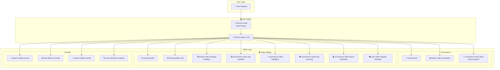

# Hermes Skills

> 🛒🎬 **Hermes Agent Skills for E-commerce Live Streaming** — Ready-to-use workflows for competitor analysis, video editing, and speech quality review

[](https://github.com/yehyakin/hermes-skills/stargazers)
[](https://github.com/yehyakin/hermes-skills/blob/main/LICENSE)
[](https://www.python.org/)
[](https://github.com/nousresearch/hermes-agent)

[English](README_en.md) | [中文](README.md)

---

## 📖 Introduction

Hermes Skills is a collection of **AI Agent skills** designed specifically for **live-streaming e-commerce scenarios**, covering the full chain needs of men's clothing live streaming:

- 🔍 **Competitor Monitoring** — Douyin video acquisition, account analysis, speech collection
- ✂️ **Video Editing** — Whisper transcription, FFmpeg precision cutting, Jianying draft generation
- ✅ **Speech Review** — Live streaming speech quality review, task delivery scoring
- 🖥️ **System Diagnostics** — Hermes/OpenClaw health monitoring, error attribution

All skills work independently or can be automatically routed via `hermes-router`.

---

## 🏗️ Architecture



---

## 🚀 Quick Start

### 1. Install Hermes Agent

```bash
git clone https://github.com/nousresearch/hermes-agent.git
cd hermes-agent
pip install -r requirements.txt
```

### 2. Clone Skills Repository

```bash
git clone https://github.com/yehyakin/hermes-skills.git
ln -s /path/to/hermes-skills ~/.hermes/skills
```

### 3. Usage Example

```
User: "Analyze this Douyin competitor video"
Agent: (auto-routes to douyin-video-acquisition)
```

---

## 📂 Skills Overview

| Category | Skills | Description |
|----------|--------|-------------|
| 🛒 Ecommerce | 3 | neirong-fuoli, douyin-video-acquisition, ecommerce-short-video-hook-research |
| 🎬 Media | 8 | jianying-editor, jianying-editor-skill, whisper-video-clipping-workflow, etc. |
| ⚖️ Audit | 4 | speech-quality-review, task-delivery-scoring, system-health-monitor, error-attribution-analysis |
| 🔀 System | 1 | hermes-router |

---

## 💼 Use Cases

### Case 1: Competitor Video Analysis Pipeline

```
User: "Analyze Qin Lei's men's clothing live streaming speech"
  ↓
hermes-router → douyin-video-acquisition (get video)
  ↓
whisper-video-clipping-workflow (transcribe)
  ↓
ecommerce-video-highlights (AI identify selling points)
  ↓
jianying-editor-skill (Jianying precision cut)
  ↓
speech-quality-review (speech quality review)
  ↓
Output: Competitor analysis report + Quality speech library
```

### Case 2: Live Stream Slicing Automation

```
User: "Cut this 3-hour stream into 10 short selling videos"
  ↓
hermes-router → ecommerce-video-clip-workflow
  ↓
Auto: Whisper transcription → SRT mining → FFmpeg precision cut → Subtitle burn
  ↓
Output: 10 short selling videos with subtitles
```

---

## 🛠️ Tech Stack

| Category | Technologies |
|----------|-------------|
| **AI Models** | OpenAI Whisper, Claude Vision, GPT-4o |
| **Video Processing** | FFmpeg, Jianying Pro, yt-dlp |
| **Frameworks** | Hermes Agent, MCP (Model Context Protocol) |
| **Languages** | Python 3.9+ |
| **Integration** | Feishu, Chrome DevTools Protocol (CDP) |

---

## 🤝 Contributing

Contributions welcome! Please see [CONTRIBUTING.md](CONTRIBUTING.md).

- 🐛 Found a bug? Submit a [Bug Report](https://github.com/yehyakin/hermes-skills/issues/new?template=bug_report.md)
- 💡 Have a feature request? Submit a [Feature Request](https://github.com/yehyakin/hermes-skills/issues/new?template=feature_request.md)

---

## 📄 License

MIT License - see [LICENSE](LICENSE)

---

*Built with ❤️ for live-streaming e-commerce teams*

*Powered by [Hermes Agent](https://github.com/nousresearch/hermes-agent)*
